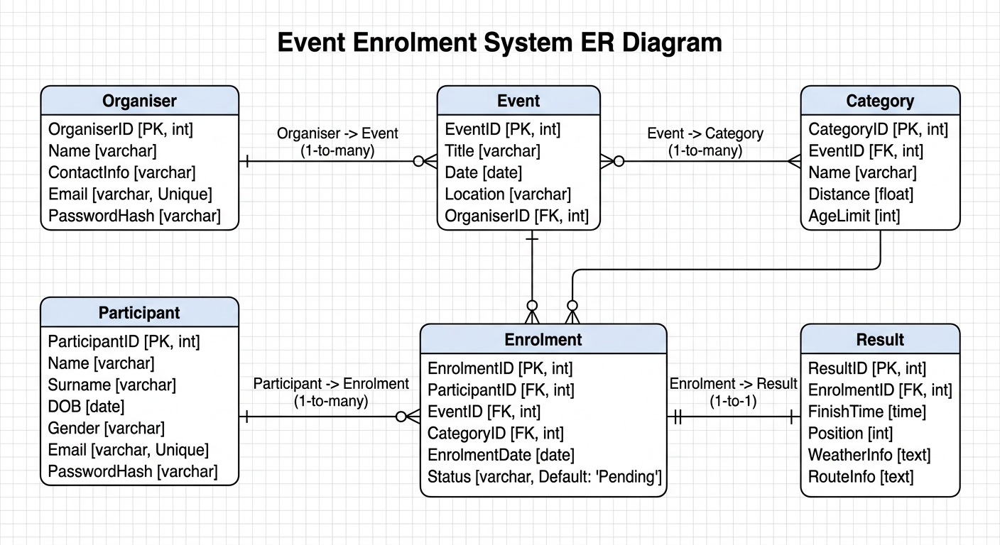

# ST10468609-Mogamat-Naeem-Meyer-RaceDay-POE

## Section A – ERD (Entity Relationship Diagram)

Organiser (OrganiserID PK, Name, ContactInfo, Email [Unique], PasswordHash)

Participant (ParticipantID PK, Name, Surname, DOB, Gender, Email [Unique], PasswordHash)
Event (EventID PK, Title, Date, Location, OrganiserID FK)
Category (CategoryID PK, EventID FK, Name, Distance, AgeLimit)
Enrolment (EnrolmentID PK, ParticipantID FK, EventID FK, CategoryID FK, EnrolmentDate, Status [Default: Pending])
Result (ResultID PK, EnrolmentID FK, FinishTime, Position, WeatherInfo, RouteInfo)

Relationships:

Organiser → Event (1‑to‑many)
Event → Category (1‑to‑many)
Participant → Enrolment (1‑to‑many)
Enrolment → Result (1‑to‑1)
Participant ↔ Event (many‑to‑many via Enrolment)

# Section B – API Endpoint Plan

## 1. Authentication
| HTTP Method | Route | Description | Role Required | Request Body | Expected Response |
|-------------|-------|-------------|---------------|--------------|------------------|
| POST | /api/auth/register | Registers a new RaceDay user (Organiser or Participant). | Public | { fullName, email, password, role, profileDetails } | 201 Created; 400 Bad Request; 409 Conflict |
| POST | /api/auth/login | Authenticates a user and returns role info + token. | Public | { email, password } | 200 OK; 401 Unauthorized |

## 2. User Profile
| HTTP Method | Route | Description | Role Required | Request Body | Expected Response |
|-------------|-------|-------------|---------------|--------------|------------------|
| GET | /api/users/me | Returns the profile of the authenticated user. | Any authenticated user | None | 200 OK; 401 Unauthorized; 404 Not Found |
| PUT | /api/users/me | Updates editable details for the authenticated user. | Any authenticated user | { fullName, contactNumber?, emergencyContact? } | 200 OK; 400 Bad Request; 401 Unauthorized |

## 3. Events
| HTTP Method | Route | Description | Role Required | Request Body | Expected Response |
|-------------|-------|-------------|---------------|--------------|------------------|
| GET | /api/events | Returns all RaceDay events. | Public | None | 200 OK |
| GET | /api/events/{id} | Returns details of a specific event. | Public | None | 200 OK; 404 Not Found |
| POST | /api/events | Creates a new event owned by the Organiser. | Organiser | { eventName, description, eventDate, location, distanceKm, eventType, maxParticipants } | 201 Created; 400 Bad Request; 401 Unauthorized; 403 Forbidden |
| PUT | /api/events/{id} | Updates an existing event. | Organiser | { eventName, description, eventDate, location, distanceKm, eventType, maxParticipants, status } | 200 OK; 400 Bad Request; 401 Unauthorized; 403 Forbidden; 404 Not Found |
| DELETE | /api/events/{id} | Deletes an event when allowed. | Organiser | None | 204 No Content; 403 Forbidden; 404 Not Found; 409 Conflict |

## 4. Categories
| HTTP Method | Route | Description | Role Required | Request Body | Expected Response |
|-------------|-------|-------------|---------------|--------------|------------------|
| GET | /api/events/{eventId}/categories | Returns all categories for an event. | Public | None | 200 OK; 404 Not Found |
| POST | /api/events/{eventId}/categories | Creates a category for an event. | Organiser | { categoryName, minAge, maxAge, fee } | 201 Created; 400 Bad Request; 401 Unauthorized; 403 Forbidden |
| PUT | /api/events/{eventId}/categories/{categoryId} | Updates a category. | Organiser | { categoryName, minAge, maxAge, fee } | 200 OK; 400 Bad Request; 401 Unauthorized; 403 Forbidden; 404 Not Found |
| DELETE | /api/events/{eventId}/categories/{categoryId} | Deletes a category if no enrolments exist. | Organiser | None | 204 No Content; 403 Forbidden; 404 Not Found; 409 Conflict |

## 5. Event Enrolments
| HTTP Method | Route | Description | Role Required | Request Body | Expected Response |
|-------------|-------|-------------|---------------|--------------|------------------|
| POST | /api/events/{eventId}/enrol | Enrols a participant in an event category. | Participant | { categoryId } | 201 Created; 400 Bad Request; 401 Unauthorized; 409 Conflict |
| GET | /api/enrolments/me | Returns all enrolments for the participant. | Participant | None | 200 OK; 401 Unauthorized; 404 Not Found |
| GET | /api/events/{eventId}/enrolments | Returns all enrolments for an organiser’s event. | Organiser | None | 200 OK; 401 Unauthorized; 403 Forbidden |

## 6. Results
| HTTP Method | Route | Description | Role Required | Request Body | Expected Response |
|-------------|-------|-------------|---------------|--------------|------------------|
| POST | /api/results | Captures a participant’s result. | Organiser | { enrolmentId, finishTime, position, weatherInfo?, routeInfo? } | 201 Created; 400 Bad Request; 401 Unauthorized; 403 Forbidden |
| GET | /api/results/{eventId} | Returns results for an event. | Public | None | 200 OK; 404 Not Found |

# Section C – SQL Database Script
CREATE TABLE Organiser (
    OrganiserID INT PRIMARY KEY IDENTITY,
    Name NVARCHAR(100) NOT NULL,
    ContactInfo NVARCHAR(200),
    Email NVARCHAR(100) UNIQUE NOT NULL,
    PasswordHash NVARCHAR(200) NOT NULL
);

CREATE TABLE Participant (
    ParticipantID INT PRIMARY KEY IDENTITY,
    Name NVARCHAR(100) NOT NULL,
    Surname NVARCHAR(100) NOT NULL,
    DOB DATE NOT NULL,
    Gender NVARCHAR(10),
    Email NVARCHAR(100) UNIQUE NOT NULL,
    PasswordHash NVARCHAR(200) NOT NULL
);

CREATE TABLE Event (
    EventID INT PRIMARY KEY IDENTITY,
    Title NVARCHAR(100) NOT NULL,
    Date DATE NOT NULL,
    Location NVARCHAR(200),
    OrganiserID INT FOREIGN KEY REFERENCES Organiser(OrganiserID)
);

CREATE TABLE Category (
    CategoryID INT PRIMARY KEY IDENTITY,
    EventID INT FOREIGN KEY REFERENCES Event(EventID),
    Name NVARCHAR(100) NOT NULL,
    Distance DECIMAL(5,2),
    AgeLimit INT
);

CREATE TABLE Enrolment (
    EnrolmentID INT PRIMARY KEY IDENTITY,
    ParticipantID INT FOREIGN KEY REFERENCES Participant(ParticipantID),
    EventID INT FOREIGN KEY REFERENCES Event(EventID),
    CategoryID INT FOREIGN KEY REFERENCES Category(CategoryID),
    EnrolmentDate DATE DEFAULT GETDATE(),
    Status NVARCHAR(50) DEFAULT 'Pending'
);

CREATE TABLE Result (
    ResultID INT PRIMARY KEY IDENTITY,
    EnrolmentID INT FOREIGN KEY REFERENCES Enrolment(EnrolmentID),
    FinishTime TIME,
    Position INT,
    WeatherInfo NVARCHAR(200),
    RouteInfo NVARCHAR(200)
);

-- Seed Data
INSERT INTO Organiser (Name, ContactInfo, Email, PasswordHash)
VALUES ('Cape Runners', '021-555-1234', 'info@caperunners.co.za', 'hash1'),
       ('Trail Masters', '021-555-5678', 'contact@trailmasters.co.za', 'hash2');

INSERT INTO Participant (Name, Surname, DOB, Gender, Email, PasswordHash)
VALUES ('Naeem', 'Meyer', '1995-06-15', 'Male', 'naeem@example.com', 'hash3'),
       ('Sarah', 'Daniels', '1998-09-20', 'Female', 'sarah@example.com', 'hash4');

INSERT INTO Event (Title, Date, Location, OrganiserID)
VALUES ('Cape Town Marathon', '2026-10-01', 'Cape Town', 1),
       ('Table Mountain Trail Run', '2026-11-12', 'Cape Town', 2),
       ('Sea Point Fun Walk', '2026-12-05', 'Sea Point', 1);

INSERT INTO Category (EventID, Name, Distance, AgeLimit)
VALUES (1, 'Marathon', 42.2, 18),
       (1, 'Half Marathon', 21.1, 16),
       (2, 'Trail 15km', 15.0, 18),
       (3, 'Family Walk', 5.0, NULL);

INSERT INTO Enrolment (ParticipantID, EventID, CategoryID, Status)
VALUES (1, 1, 1, 'Confirmed'),
       (2, 3, 4, 'Confirmed');

INSERT INTO Result (EnrolmentID, FinishTime, Position, WeatherInfo, RouteInfo)
VALUES (1, '03:45:00', 12, 'Sunny', 'Standard Route'),
       (2, '01:10:00', 5, 'Cloudy', 'Sea Point Loop');

## Commit History 

1 Initial project setup

2 Created repository, added .gitignore, and initialized README.

3 Add project documentation folder

4 Created /docs directory for ERD, API plan, and SQL script.

5 Draft ERD structure

6 Added initial ERD diagram with entities and relationships.

7 Refine ERD with attributes and keys

8 Updated ERD to include PKs, FKs, and cardinality.

9 Add API endpoint plan (draft)

10 Created Markdown file with basic endpoint routes and methods.

11 Expand API endpoint plan with roles and responses

12 Added role enforcement, request bodies, and success/failure cases.

13 Finalize API endpoint plan

14 Completed endpoint plan with all sections: Authentication, User Profile, Events, Categories, Enrolments, Results.

15 Create SQL database script (tables)

16 Added RaceDay.sql with CREATE TABLE statements for all entities.

17 Add constraints to SQL script

18 Defined PKs, FKs, UNIQUE, NOT NULL, and DEFAULT values.

19 Insert seed data into SQL script

20 Added sample organisers, participants, events, categories, enrolments, and results.

21 Test SQL script execution

22 Verified script runs cleanly on fresh SQL Server instance.

23 Update README with system overview

25 Added RaceDay description, roles, and setup notes. Read for submission

